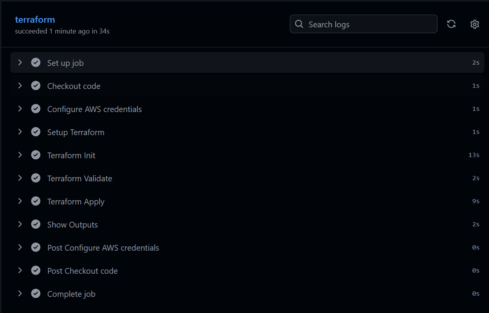

# Projeto Cloud

## Autores

* Vicente Gama
* Rafael Martins

## Descrição do Projeto

Este projeto foi desenvolvido no âmbito da unidade curricular de Cloud  e demonstra a implementação de uma infraestrutura cloud utilizando serviços AWS e Infrastructure as Code (IaC).

Toda a estrutura é criada automaticamente através do Terraform e gerida através de um pipeline CI/CD implementado com GitHub Actions

## Tecnologias Utilizadas

* AWS
* Terraform
* Docker
* Docker Compose
* Ansible
* GitHub Actions
* PostgreSQL (Amazon RDS)
* Amazon SQS

## Componentes da Infraestrutura

O projeto inclui:

* VPC personalizada
* Duas subnets públicas
* Duas subnets privadas
* Internet Gateway
* Instância EC2
* Base de dados PostgreSQL (RDS)
* Fila Amazon SQS
* Dead Letter Queue (DLQ)
* Docker Containers
* Pipeline CI/CD

## Estrutura do Projeto


├── terraform/
├── ansible/
├── semana2/
│   ├── service-a/
│   ├── service-b/
│   └── docker-compose.yml
├── docs/
├── .github/workflows/
└── README.md


## Execução Local

```bash
cd semana2
docker compose up --build
```

## Deploy da Infraestrutura

```bash
cd terraform

terraform init

terraform validate

terraform plan

terraform apply
```

## Pipeline CI/CD

Sempre que é realizado um push para a branch main, o GitHub Actions executa automaticamente:

* Validação da infraestrutura Terraform
* Deploy da infraestrutura AWS
* Atualização dos recursos existentes

## Outputs Terraform

Após o deploy são disponibilizados:

* Endereço IP público da EC2
* Endpoint da base de dados RDS
* URL da fila SQS
* ID da VPC

## Objetivos do Projeto

* Aplicar conceitos de Cloud Computing
* Automatizar infraestrutura através de Terraform
* Implementar CI/CD utilizando GitHub Actions
* Utilizar serviços AWS de forma integrada
* Aplicar boas práticas de segurança

## Pipeline CI/CD

A Figura 1 apresenta uma execução bem-sucedida do pipeline GitHub Actions responsável pela validação e implementação automática da infraestrutura AWS.

