# Projeto Cloud

## Autores

* Vicente Gama
* Rafael Martins

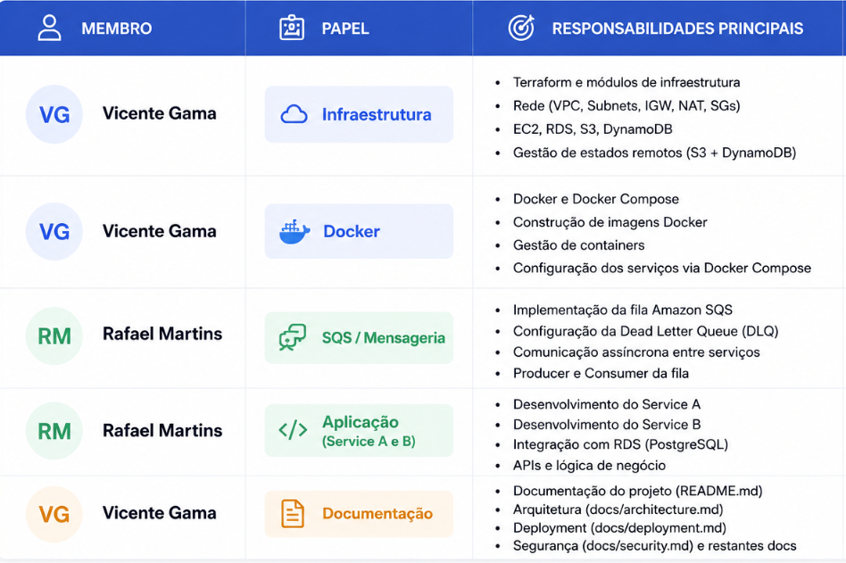  

## Descrição do Projeto

Este projeto foi desenvolvido no âmbito da unidade curricular de Cloud  e demonstra a implementação de uma infraestrutura cloud utilizando serviços AWS e Infrastructure as Code 

Toda a estrutura é criada automaticamente através do Terraform e gerida através de um pipeline CI/CD implementado com GitHub Actions

## Tecnologias Utilizadas

* AWS
* Terraform
* Docker
* Docker Compose
* Ansible
* GitHub Actions
* PostgreSQL (Amazon RDS)
* Amazon SQS

## Componentes da Infraestrutura

O projeto inclui:

* VPC personalizada
* Duas subnets públicas
* Duas subnets privadas
* Internet Gateway
* Instância EC2
* Base de dados PostgreSQL (RDS)
* Fila Amazon SQS
* Dead Letter Queue (DLQ)
* Docker Containers
* Pipeline CI/CD

## Estrutura do Projeto

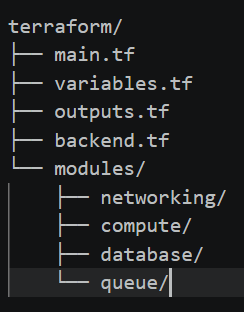


## Execução Local

```bash
cd semana2
docker compose up --build
```

## Deploy da Infraestrutura

```bash
cd terraform

terraform init

terraform validate

terraform plan

terraform apply
```

## Pipeline CI/CD

Sempre que é realizado um push para a branch main, o GitHub Actions executa automaticamente:

* Validação da infraestrutura Terraform
* Deploy da infraestrutura AWS
* Atualização dos recursos existentes

## Outputs Terraform

Após o deploy são disponibilizados:

* Endereço IP público da EC2
* Endpoint da base de dados RDS
* URL da fila SQS
* ID da VPC

## Objetivos do Projeto

* Aplicar conceitos de Cloud Computing
* Automatizar infraestrutura através de Terraform
* Implementar CI/CD utilizando GitHub Actions
* Utilizar serviços AWS de forma integrada
* Aplicar boas práticas de segurança


## Pipeline CI/CD

A Figura apresenta uma execução bem-sucedida do pipeline GitHub Actions responsável pela validação e implementação automática da infraestrutura AWS


## Outputs Terraform

A Figura apresenta os outputs gerados após a implementação da infraestrutura. Estes valores permitem identificar os recursos criados, incluindo a VPC, a instância EC2, a base de dados RDS e a fila SQS
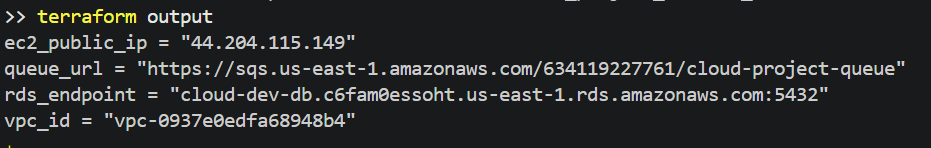

## Infraestrutura de Rede

A Figura apresenta a VPC criada através do Terraform. Esta rede constitui a base da infraestrutura cloud, contendo subnets públicas e privadas distribuídas por diferentes zonas de disponibilidade

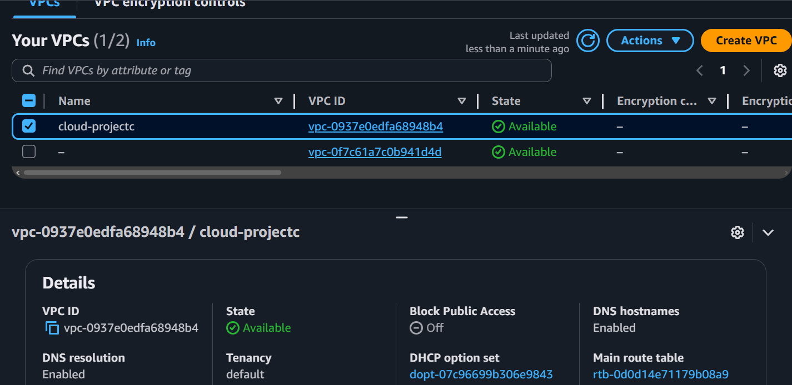

## Instância EC2

A Figura mostra a instância EC2 responsável pela execução da aplicação. A instância encontra-se ativa e acessível através do endereço IP público atribuído pela AWS
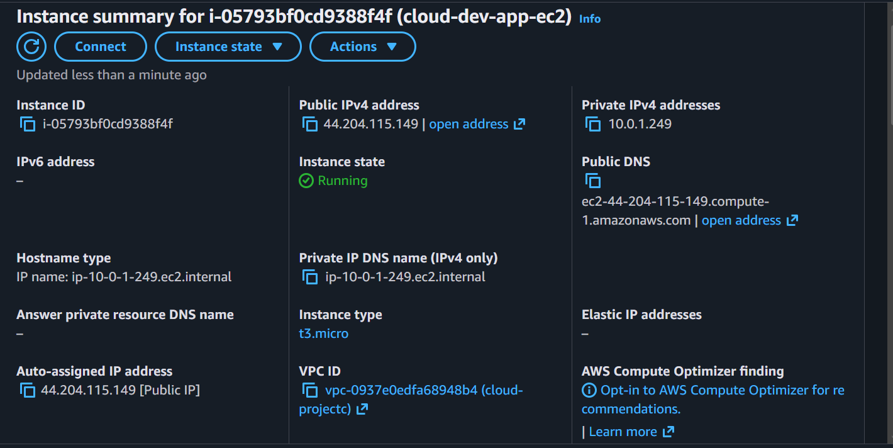

## Base de Dados PostgreSQL

A Figura apresenta a instância Amazon RDS PostgreSQL utilizada para armazenamento persistente de dados. A base de dados encontra-se implementada em subnets privadas para aumentar a segurança da solução
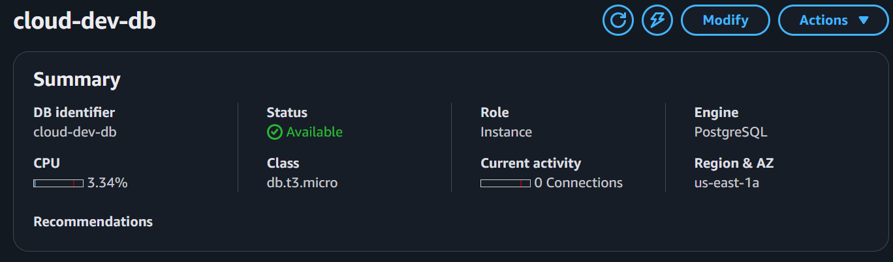

## Sistema de Mensagens

As Figuras apresentam as filas Amazon SQS utilizadas para comunicação assíncrona entre serviços. É possível observar a fila principal e a respetiva Dead Letter Queue (DLQ)

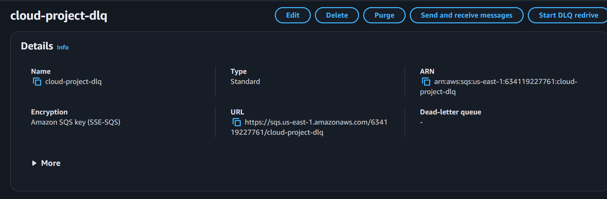

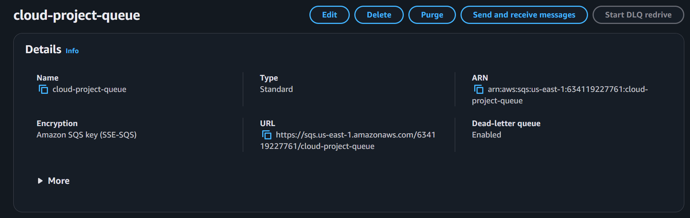

## Recursos Geridos pelo Terraform

A Figura demonstra os recursos atualmente geridos pelo Terraform. É possível verificar a presença da VPC, EC2, RDS, SQS e restantes componentes da infraestrutura

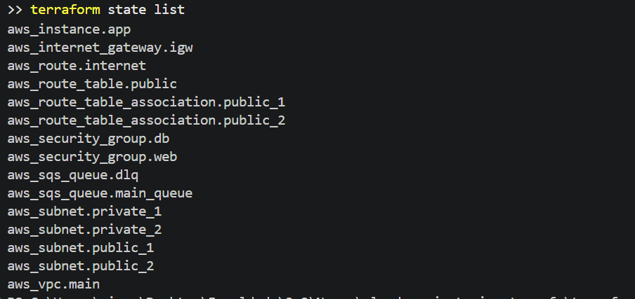

## Execução Local dos Serviços

A Figura apresenta a execução local dos serviços através do Docker Compose. Os serviços são iniciados automaticamente e comunicam entre si utilizando a infraestrutura definida para o projeto

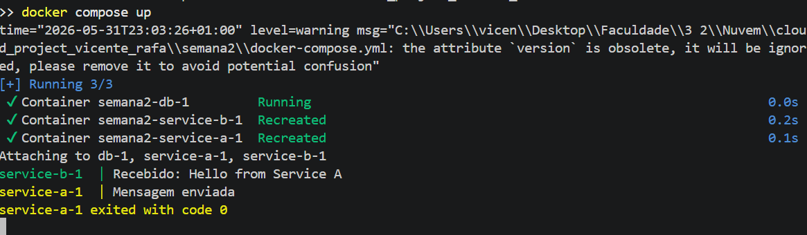

## Organização do Projeto

A Figura apresenta a estrutura final do projeto. A organização adotada separa claramente a infraestrutura, a configuração, os serviços da aplicação e a documentação

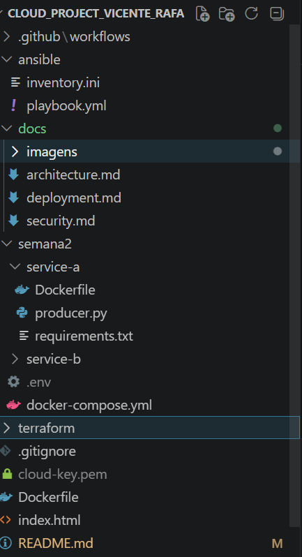

## Arquitetura da Solução

A Figura apresenta uma visão geral da arquitetura implementada. A solução utiliza uma instância EC2 para execução da aplicação, uma base de dados PostgreSQL para persistência de dados e o Amazon SQS para comunicação assíncrona entre serviços


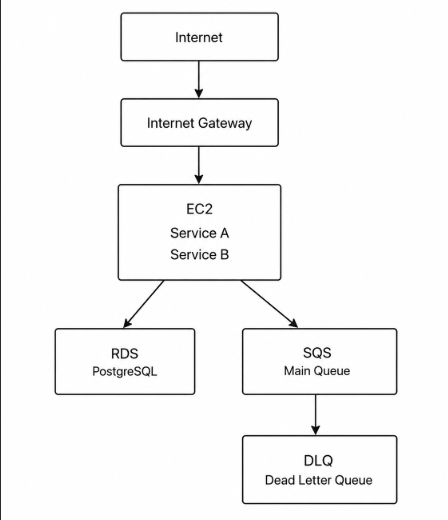